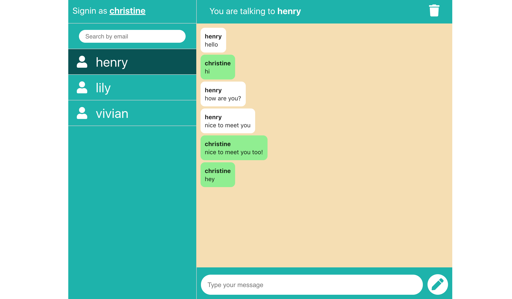

# React Chat

`React Chat` is a real time chat application built by using React that allows users to send and receive real-time messages. Firebase is being used as the backend which provides authentication and databse for the app.

## [Live Demo](https://react-chat-my-app.herokuapp.com/)

### Tools used in this project:

|                               Tool                               | Description                                                                                               |
| :--------------------------------------------------------------: | --------------------------------------------------------------------------------------------------------- |
|       [React](http://facebook.github.io/react/index.html)        | A JavaScript library for building user interfaces                                                         |
|                  [Redux](https://redux.js.org/)                  | A JavaScript library for managing application state                                                       |
|                  [SASS](https://sass-lang.com/)                  | Sass is the most mature, stable, and powerful professional grade CSS extension language in the world.     |
| [Firebase Authentication](https://firebase.google.com/docs/auth) | Provides backend services, easy-to-use SDKs, and ready-made UI libraries to authenticate users to the app |
| [Firebase Firestore](https://firebase.google.com/docs/firestore) | A flexible, scalable NoSQL cloud database to store and sync data for client- and server-side development  |
